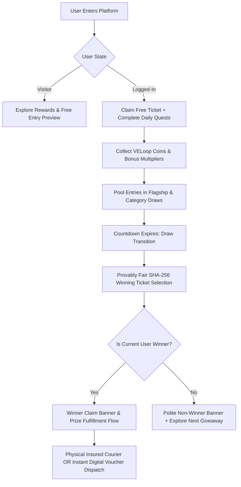
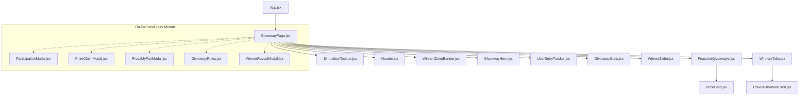

# 🎁 VELoop Rewards - Sweepstakes & Giveaway Platform

[](https://reactjs.org/)
[](https://vitejs.dev/)
[](https://www.framer.com/motion/)
[](https://lucide.dev/)
[](https://en.wikipedia.org/wiki/SHA-2)
[](LICENSE)

> A modern, high-performance, provably fair sweepstakes and giveaway reward experience engineered for the **VELoop Rewards** ecosystem. Built with a rich cyberpunk/fintech dark aesthetic, GPU-accelerated micro-animations, accessible keyboard navigation, decoupled service layers, and dynamic lifecycle state management.

---

## 📑 Table of Contents
1. [Project Overview](#-project-overview)
2. [Giveaway Concept](#-giveaway-concept)
3. [Features](#-features)
4. [Giveaway States](#-giveaway-states)
5. [Winner System](#-winner-system)
6. [Prize Claim System](#-prize-claim-system)
7. [Technology Stack](#-technology-stack)
8. [Installation](#-installation)
9. [Development](#-development)
10. [Build & Optimization](#-build--optimization)
11. [Folder Structure](#-folder-structure)
12. [Component Architecture](#-component-architecture)
13. [Responsive Design](#-responsive-design)
14. [Animation Details](#-animation-details)
15. [Mock Data Structure](#-mock-data-structure)
16. [Future Backend Integration](#-future-backend-integration)
17. [Screenshots](#-screenshots)
18. [Live Demo](#-live-demo)

---

## 🌟 Project Overview
**VELoop Rewards** is a gamified loyalty reward and giveaway web application. Users participate in free and tier-boosted prize draws, accumulate digital entries via engagement tasks, verify drawing fairness through cryptographic proofs, and seamlessly claim physical hardware or instant digital voucher prizes.

The platform provides:
- **Instant visual engagement** with glassmorphism, dynamic cursor spotlights, and interactive 3D card tilt effects.
- **Fairness assurance** with public server seed hashing, client seeds, and open SHA-256 validation algorithms.
- **Resilient UX** featuring shimmer skeleton loaders, contextual empty states, and intuitive error boundaries with automatic retry workflows.

---

## 🎯 Giveaway Concept



1. **Free Tier Guaranteed**: Every authenticated user receives free baseline entries per giveaway pool.
2. **Engagement Amplifiers**: Users complete daily activity quests (e.g., Daily Check-in, Friend Referrals, Social Follows) to earn loyalty coins and unlock higher ticket tiers.
3. **Provably Fair Draws**: Every winner is selected using reproducible cryptographic hashes combining server seeds, client seeds, and block entropy.

---

## ✨ Features

- **Dynamic Grand Prize Hero**: Layered reward showcase with interactive cursor spotlight, live badges, and provably fair SHA-256 verification modal trigger.
- **Microsecond Countdown Timer**: Real-time flip-animation countdown with graceful zero-state transition into draw evaluation mode.
- **Community Winner Slider**: Continuous ticker loop highlighting recent winners (`VE****21`, `VE****83`) with pause-on-hover capability and ethical demo disclaimers.
- **Filterable Giveaway Grid**: Filter active reward pools by category (*All*, *Flagship Mobile*, *Luxury Wearables*, *Audio*, *Digital Gift Cards*).
- **Interactive Multi-Tab Archive**:
  - *Current Active Pools*: Real-time participant counters and time remaining.
  - *Spotlight Winners*: Verified testimonial reviews and user reactions.
  - *Previous Draws Archive*: Comprehensive winner list supporting **Cards Grid** and **Detailed Table View** with live search filtering.
- **Interactive Winner Reveal Experience**: 3-second animated draw sequence with shuffling ticket digits, audio drumroll FX, and particle confetti explosion.
- **Comprehensive Skeleton Suite**: Shimmer loaders for Hero cards, Prize tiles, Previous winners, and Metric counters.
- **Contextual Empty States**: Custom illustrations for *No Previous Winners*, *No Current Giveaway*, and *No Active Participation*.

---

## 🔄 Giveaway States

The application orchestrates **7 distinct user-context states** and a **5-stage giveaway lifecycle**:

### 7 User Personas (Interactive Simulation Toolbar)
| State | Persona | Visual Behavior | Primary CTA |
|---|---|---|---|
| **1** | **Visitor (Guest)** | Logged-out state, demo balances hidden | `[Login / Signup to Participate →]` |
| **2** | **Logged-In (0 Tickets)** | User authenticated, 0 tickets allocated | `[Enter Giveaway Free →]` |
| **3** | **Participant** | Shows active ticket badge & odds breakdown | `[Earn More Entries (Quests) →]` |
| **4** | **Winner** | Golden confetti celebration banner & claim form | `[Claim Your Prize 🎁]` |
| **5** | **Non-Winner** | Polite participation appreciation message | `[Explore Rewards 🚀]` |
| **6** | **Giveaway Ended** | Archived status with official verified winner info | `[Watch Winner Reveal 🎬]` |
| **7** | **Upcoming State** | Pre-launch banner (`Starts In 3 Days`) | `[Notify Me 🔔]` & `[Explore Rewards]` |

### 5-Stage Giveaway Lifecycle
```
1. Current Giveaway (Live) 
   ↓ 
2. Giveaway Ends (Countdown Reaches 00:00:00) 
   ↓ 
3. Winners Announced (Cryptographic SHA-256 Resolution) 
   ↓ 
4. Current Winners Move to Previous Winners Archive 
   ↓ 
5. New Giveaway Becomes Current
```

---

## 🏆 Winner System

- **Provably Fair Cryptographic Algorithm**:
  $$\text{Winning Index} = \text{hexToDecimal}(\text{SHA-256}(\text{ServerSeed} + \text{ClientSeed} + \text{Nonce})) \pmod{\text{TotalTickets}}$$
- **Identity Privacy**: Winner handles are masked for privacy compliance (e.g. `VE****42`, `VE****91`, `VE****27`).
- **Transparency Audit**: The `ProvablyFairModal` enables any participant to inspect seeds, verify SHA-256 hashes, and validate the winning ticket.

---

## 📦 Prize Claim System

Centralized through [prizeTypeUtils.js](file:///d:/Internship%20Project/VELoop%20Rewards/frontend/src/utils/prizeTypeUtils.js), the platform eliminates scattered business logic and automatically adjusts claim requirements based on prize categorization:

| Prize Type | Examples | Required Fields | Fulfillment Method | Delivery Estimate |
|---|---|---|---|---|
| **PHYSICAL** | iPhone 15 Pro, Apple Watch, AirPods | Full Name, Phone, Address, City, State, PIN | Insured Express Courier (FedEx/BlueDart) | 3–5 Business Days |
| **GIFT_CARD** | Amazon ₹2,000 Card, Apple Gift Card | Full Name, Recipient Email | Instant Digital Voucher Code Dispatch | Instant (< 15 mins) |
| **DIGITAL_KEY** | Game Pass Ultimate, Steam Keys | Recipient Email, GamerTag / ID | Official License Key Activation | Instant (< 5 mins) |
| **EXPERIENCE** | VIP Launch Event Pass | Full Name, Phone, Email | VIP Concierge Direct Contact | 24–48 Hours |

---

## 💻 Technology Stack

- **Core Framework**: React 18 (Functional Components, Custom Hooks)
- **Build Tool**: Vite 5 (Hot Module Replacement, Rollup Code Splitting)
- **Styling Architecture**: Vanilla CSS Modules + CSS Custom Properties Design System
- **Animation Engine**: Framer Motion 11 (Layout transitions, spring physics, dynamic exit animations)
- **Icons**: Lucide React
- **Audio Synthesizer**: Web Audio API Procedural SFX (`soundFx.js`)
- **Particle System**: HTML5 2D Canvas Confetti Engine (`confetti.js`)

---

## 🛠️ Installation

### Prerequisites
- Node.js `v18.0.0` or higher
- npm `v9.0.0` or higher

```bash
# 1. Clone repository
git clone https://github.com/nithintechie123/VELoop-Rewards-GPT.git

# 2. Enter project directory
cd VELoop-Rewards/frontend

# 3. Install dependencies
npm install
```

---

## 💻 Development

Start the local Vite development server:
```bash
npm run dev
```
Open your browser at `http://localhost:5173/`.

### Sandbox Toolbar
Use the top **Simulation Toolbar** to test all 7 user states, cycle lifecycle stages, trigger error boundaries, and inspect skeleton loaders without touching backend records.

---

## 🏗️ Build & Optimization

Build the production bundle:
```bash
npm run build
```

Preview the production build locally:
```bash
npm run preview
```

### Production Chunk Splitting
```
dist/
├── assets/
│   ├── vendor-react-*.js        # React & React-DOM
│   ├── vendor-motion-*.js       # Framer Motion
│   ├── vendor-icons-*.js        # Lucide React icons
│   ├── PrizeClaimModal-*.js     # Lazy-loaded claim portal
│   ├── ParticipationModal-*.js  # Lazy-loaded ticket pool modal
│   ├── WinnerRevealModal-*.js   # Lazy-loaded 3D reveal animation
│   ├── ProvablyFairModal-*.js   # Lazy-loaded cryptographic audit
│   └── index-*.js               # Core app entry bundle
└── index.html
```

---

## 📁 Folder Structure

```
frontend/
├── public/
│   └── assets/
│       └── images/               # High-res prize imagery (Apple Bundle, iPhone, etc.)
├── src/
│   ├── components/
│   │   ├── Countdown/            # Real-time flip timer
│   │   ├── EmptyState/           # No winners / No active pool illustrations
│   │   ├── ErrorState/           # Error recovery boundary & reconnect flow
│   │   ├── FeaturedGiveaways/    # Categorized reward card feed
│   │   ├── GiveawayHero/         # Grand prize showcase & 3D tilt
│   │   ├── GiveawayRules/        # Eligibility, FAQ & Terms modal
│   │   ├── GiveawayStats/        # Real-time participation statistics
│   │   ├── Header/               # Navigation, brand & coin balances
│   │   ├── ParticipationModal/   # Tier entry calculation modal
│   │   ├── PreviousWinnerCard/   # Cards / Table archive view with search
│   │   ├── PrizeCard/            # Interactive reward card with spotlight
│   │   ├── PrizeClaimModal/      # Multi-type prize redemption portal
│   │   ├── ProvablyFairModal/    # SHA-256 seed & hash verification modal
│   │   ├── SimulationToolbar/    # Live testing & user state controller
│   │   ├── Skeletons/            # Shimmer loading placeholders
│   │   ├── UserEntryTracker/     # User odds & active ticket breakdown
│   │   ├── WinnerClaimBanner/    # Winner celebration / claim banner
│   │   ├── WinnerReveal/         # Animated cryptographic winner reveal
│   │   ├── WinnersTabs/          # Active pools, spotlight & archive tabs
│   │   └── WinnerSlider/         # Continuous ticker of recent winners
│   ├── data/
│   │   └── giveawayData.js       # Standardized mock data & prize models
│   ├── pages/
│   │   └── Giveaway/             # Main Giveaway Page orchestrator
│   ├── services/
│   │   └── api.js                # REST API client with mock fallback
│   ├── styles/
│   │   └── index.css             # Design tokens, variables & glassmorphism
│   ├── utils/
│   │   ├── confetti.js           # Canvas particle burst engine
│   │   ├── prizeTypeUtils.js     # Centralized prize schemas & business logic
│   │   └── soundFx.js            # Web Audio API sound FX synthesizer
│   ├── App.jsx                   # Root application wrapper
│   └── main.jsx                  # React DOM mount point
├── index.html
├── package.json
└── vite.config.js                # Rollup code splitting & build configuration
```

---

## 🏛️ Component Architecture



---

## 📱 Responsive Design

The application is built mobile-first with adaptive layouts:
- **Mobile (< 640px)**: Single column stacked layout, touch-optimized modal dialogs, horizontal scrolling tab navigation.
- **Tablet (640px – 1024px)**: 2-column balanced grid, compact ticket tracking cards.
- **Desktop (1024px+)**: Dual-column 3D tilt hero layout, 3-column prize grid, expanded statistical metrics.
- **Ultra-Wide (1440px+)**: Constrained maximum container width (`1280px`) with centered ambient backdrop glow.

---

## 🎨 Animation Details

- **Hardware Acceleration**: GPU-accelerated `transform` and `opacity` animations prevent DOM reflows and ensure steady 60 FPS performance.
- **3D Cursor Spotlight**: Mouse position calculates real-time subtle perspective rotations on the Hero showcase card.
- **Shimmer Skeletons**: CSS keyframe wave gradient animating across placeholder shapes while asynchronous data resolves.
- **Audio Feedback**: Procedural Web Audio API sound FX triggered on clicks, modal opens, coin bonus claims, and winner reveals.
- **Confetti Engine**: Native HTML5 `<canvas>` rendering 80+ physics particles upon winner declaration.

---

## 🗄️ Mock Data Structure

```javascript
// giveawayData.js
export const mockHeroGiveaway = {
  id: "GW-2026-08",
  title: "Summer Rewards Giveaway - Apple Studio Ultimate Creator Bundle",
  subtitle: "Space Black MacBook Pro M3 Max + Apple 27\" 5K Studio Display + AirPods Max",
  prizeType: PRIZE_TYPES.PHYSICAL,
  valueUSD: 359999,
  status: "active",
  endDate: "2026-08-31T23:59:59.000Z",
  totalParticipants: 8500,
  totalTickets: 18450,
  prizes: mockPrizes
};
```

---

## 🔌 Future Backend Integration

The frontend uses a decoupled service layer in [api.js](file:///d:/Internship%20Project/VELoop%20Rewards/frontend/src/services/api.js). To connect to a live backend:

1. Configure `.env`:
   ```env
   VITE_API_BASE_URL=https://api.veloop-rewards.io/v1
   ```
2. Implemented endpoints:
   - `GET /giveaways/current` $\to$ Returns active hero draw & prize tiers.
   - `GET /giveaways` $\to$ Returns active giveaway pools list.
   - `GET /giveaways/winners/previous` $\to$ Returns previous winners archive.
   - `POST /giveaways/:id/join` $\to$ Submits ticket entry with auth token.
   - `POST /giveaways/:id/claim` $\to$ Submits recipient shipping/email details.
   - `GET /giveaways/:id/fairness` $\to$ Returns cryptographic seed proofs.

---

## 📸 Screenshots

*(To capture live application screenshots, run `npm run dev` and navigate through the Simulation Toolbar presets.)*

| Desktop Flagship View | Winner Celebration State |
|---|---|
| *Hero showcase with 3D perspective spotlight and countdown* | *Golden confetti banner with recipient claim portal* |

---

## 🌐 Live Demo

- **GitHub Repository**: [https://github.com/nithintechie123/VELoop-Rewards-GPT.git](https://github.com/nithintechie123/VELoop-Rewards-GPT.git)
- **Local Dev Server**: `http://localhost:5173`

---

## 📄 License
This project is open-sourced under the **MIT License**.
