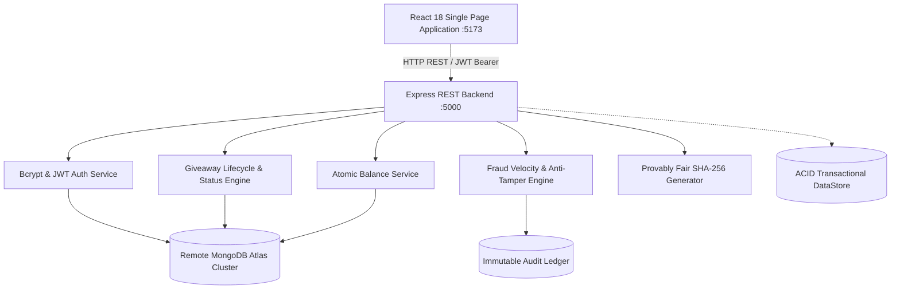
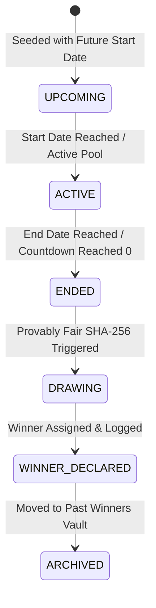

# 🎁 VELoop Rewards - Provably Fair Sweepstakes & Loyalty Platform

[](https://reactjs.org/)
[](https://vitejs.dev/)
[](https://nodejs.org/)
[](https://expressjs.com/)
[](https://www.mongodb.com/atlas)
[](https://www.framer.com/motion/)
[](https://en.wikipedia.org/wiki/SHA-2)
[](LICENSE)

> A high-performance, full-stack, provably fair sweepstakes and giveaway reward experience engineered for the **VELoop Rewards** ecosystem. Built with a rich cyberpunk/fintech dark aesthetic, zero-trust backend validation, real MongoDB Atlas authentication with Bcrypt and JWT token rotation, atomic wallet balance management, and immutable audit logging.

---

## 📑 Table of Contents
1. [Platform Architecture](#-platform-architecture)
2. [Key Features](#-key-features)
3. [Real User Authentication & Security](#-real-user-authentication--security)
4. [Giveaway Lifecycle & Zero-Trust Backend](#-giveaway-lifecycle--zero-trust-backend)
5. [Provably Fair SHA-256 Engine](#-provably-fair-sha-256-engine)
6. [Multi-Currency Wallet System](#-multi-currency-wallet-system)
7. [Prize Claim & Fulfillment](#-prize-claim--fulfillment)
8. [Technology Stack](#-technology-stack)
9. [Project Directory Structure](#-project-directory-structure)
10. [REST API Documentation](#-rest-api-documentation)
11. [Installation & Getting Started](#-installation--getting-started)
12. [Automated Test Suites](#-automated-test-suites)
13. [License](#-license)

---

## 🌟 Platform Architecture



- **Frontend**: React 18, Vite 5, Framer Motion, Vanilla CSS Modules, Lucide React, Web Audio API sound synthesizers, and HTML5 Canvas confetti particles.
- **Backend**: Node.js, Express, Mongoose, MongoDB Atlas remote cluster with automated failover to an ACID transactional local DataStore, Bcrypt password hashing, and JWT Access/Refresh token rotation.
- **Single Source of Truth**: Giveaway configurations, eligibility rules, ticket counts, and draw outcomes are authoritatively computed on the server—client values are never trusted.

---

## ✨ Key Features

- **Real Database Authentication**: Full registration and login workflows with 256-bit Bcrypt hashing and JWT token rotation stored directly in MongoDB Atlas.
- **Auto-Redirect on Non-Existent Users**: When an unregistered user enters their email on `/login`, the system automatically routes them to `/login?mode=signup` with their email prefilled.
- **Flagship Grand Prize Hero**: Layered reward showcase with interactive 3D perspective spotlight, live participant tickers, and real-time countdown.
- **Atomic Multi-Currency Ticket Minting**: Debits user coin balances (`VEs`, `SVEs`, `Tokens`) in an isolated transaction and mints formatted tickets (e.g. `#VEL-9XY82-US`).
- **Fraud & Velocity Protection**: Throttles rapid-fire burst traffic (HTTP 429), blocks negative ticket tampering, and flags suspicious activity in an immutable audit ledger.
- **Provably Fair SHA-256 Verification**: Users can inspect server seed hashes, client seeds, nonces, and verify draw fairness deterministically.
- **Multi-Format Prize Claims**: Handles physical shipments (express courier tracking), instant digital gift cards, gamer keys, and VIP experience vouchers.

---

## 🔐 Real User Authentication & Security

All user accounts and credentials are encrypted and stored in **MongoDB Atlas**:

1. **Password Hashing**: Plaintext passwords are encrypted using **Bcrypt** with 10 salt rounds before database insertion.
2. **Dual-Token JWT Strategy**:
   - `accessToken`: Short-lived token (`15m`) sent via HTTP Bearer headers and secure cookies.
   - `refreshToken`: Long-lived token (`7d`) rotated on each login and session refresh.
3. **Session Hydration**: On initial application load, the frontend hits `GET /api/auth/me` to hydrate real user balances and tier status.
4. **Welcome Bonus**: Newly registered accounts automatically receive **+500 VEs** and **+500 Tokens** welcome credit directly in the database.

---

## 🔄 Giveaway Lifecycle & Zero-Trust Backend



### Zero-Trust Enforcement Rules
1. **Unauthenticated Access**: Direct participation without a valid JWT token is rejected (`401 UNAUTHORIZED`).
2. **Authoritative Status**: Attempting to enter an `ENDED` or `UPCOMING` giveaway is rejected by the backend authority (`400 GIVEAWAY_INACTIVE`).
3. **Balance Verification**: The server calculates the exact required entry fee against the live database balance. Insufficient funds return `402 INSUFFICIENT_BALANCE`.
4. **Free Daily Limits**: Enforces exactly 1 free baseline entry per user per giveaway pool per day (`400 FREE_ENTRY_LIMIT_REACHED`).

---

## 🎲 Provably Fair SHA-256 Engine

Winners are selected using a verifiable cryptographic formula:

$$\text{Winning Index} = \text{hexToDecimal}(\text{SHA-256}(\text{ServerSeed} + \text{ClientSeed} + \text{Nonce})) \pmod{\text{TotalTickets}}$$

- **Server Seed Hash**: Published before the draw starts (`SHA-256` digest).
- **Client Seed**: Combined entropy from public blockchain block hashes and community inputs.
- **Audit Tooling**: Anyone can copy the seed inputs and rerun the SHA-256 algorithm in third-party cryptographic utilities to verify that the winner was selected fairly.

---

## 💰 Multi-Currency Wallet System

| Currency | Symbol | Primary Utility | Acquisition Method |
|---|---|---|---|
| **VELoop Coins** | `VEs` | Standard entry currency for flagship & luxury prize pools | Daily Login, Quest Tasks, Signup Bonus |
| **Super VELoop Coins** | `SVEs` | Premium entry currency for VIP and high-odds pools | Tier Level-Up, Leaderboard Rewards |
| **Tokens** | `Tokens` | Utility currency for instant tickets & coin conversion | Daily Check-in Bonus, Quests |

---

## 📦 Prize Claim & Fulfillment

| Prize Type | Examples | Required Information | Fulfillment Channel | ETA |
|---|---|---|---|---|
| **PHYSICAL** | MacBook Pro, iPhone 15 Pro, Watch Series 9 | Full Name, Phone, Shipping Address, PIN | Insured Express Courier (FedEx / BlueDart) | 3–5 Days |
| **GIFT_CARD** | Amazon ₹2,000 Voucher, Apple Card | Recipient Email | Automated Digital Code Dispatch | Instant (< 15 min) |
| **DIGITAL_KEY** | Xbox Game Pass Ultimate, Steam Keys | GamerTag / Recipient Email | License Key Activation Portal | Instant (< 5 min) |
| **EXPERIENCE** | VIP Event Tickets, Concert Passes | Full Name, ID, Phone | VIP Concierge Direct Dispatch | 24–48 Hours |

---

## 💻 Technology Stack

### Frontend
- **Framework**: React 18.3 (Functional Architecture, Custom Hooks)
- **Bundler & Dev Server**: Vite 5.4
- **Animation Engine**: Framer Motion 11 (GPU-accelerated springs, layout transitions)
- **Styling**: Vanilla CSS Modules with custom design tokens (dark fintech theme)
- **Icons**: Lucide React
- **Sound Synthesis**: Web Audio API procedural synthesizer (`soundFx.js`)
- **Particle System**: HTML5 2D Canvas confetti generator (`confetti.js`)

### Backend
- **Runtime**: Node.js 20+
- **Server Framework**: Express 4.21 (Modular MVC Architecture)
- **Database Engine**: Remote MongoDB Atlas Cluster (`Mongoose 8.x`)
- **Fallback DataStore**: High-Performance ACID Transactional Engine (`database.json`)
- **Authentication**: BcryptJS (`10 salt rounds`) + JSONWebToken (`JWT`)
- **Security**: Rate-limiting, XSS filtering, CORS whitelisting, HTTP-only Cookies

---

## 📁 Project Directory Structure

```
VELoop-Rewards/
├── backend/
│   ├── src/
│   │   ├── config/             # DB & Environment Configuration (db.js, index.js)
│   │   ├── controllers/        # Express Route Controllers (auth, giveaway, claim, etc.)
│   │   ├── data/               # Persistent Store & Seed Data (store.js, initialSeedData.js)
│   │   ├── middleware/         # Auth, Rate-Limit, Fraud, and Validation Middlewares
│   │   ├── models/             # Mongoose Schemas (User, Giveaway, Prize, AuditLog, etc.)
│   │   ├── routes/             # Express API Endpoints
│   │   ├── services/           # Core Business Logic (balance, fraud, giveaway, winner)
│   │   ├── utils/              # Cryptographic SHA-256 Engine & Structured Logger
│   │   └── app.js              # Express App Definition
│   ├── tests/
│   │   ├── authTests.js        # Real Bcrypt & JWT Auth Test Suite
│   │   └── backendTests.js     # Zero-Trust, Balance, and Fraud Test Suite
│   ├── server.js               # Entry Point (Port 5000)
│   └── package.json
│
├── frontend/
│   ├── src/
│   │   ├── components/         # Modular UI Components (Header, Hero, Modals, Cards, etc.)
│   │   ├── context/            # Centralized React AuthContext
│   │   ├── data/               # Fallback UI dataset
│   │   ├── pages/
│   │   │   ├── Auth/           # Real Login & Registration Page (LoginPage.jsx)
│   │   │   ├── Giveaway/       # Main Sweepstakes Portal (GiveawayPage.jsx)
│   │   │   └── GiveawayDetails/# Individual Giveaway Detail View
│   │   ├── services/           # API & Auth Service Layers (api.js, authService.js)
│   │   ├── styles/             # Global CSS Variables, Tokens & Custom Bootstrap
│   │   └── utils/              # Sound FX, Confetti, and Prize Type Helpers
│   ├── package.json
│   └── vite.config.js
│
├── .gitignore
├── package.json                # Root Concurrently Orchestrator
└── README.md
```

---

## 📡 REST API Documentation

Base URL: `http://localhost:5000/api`

### 🔑 Authentication (`/api/auth`)
| Method | Endpoint | Description | Auth Required |
|---|---|---|---|
| `POST` | `/auth/register` | Register new user with Bcrypt password & 500 VEs bonus | No |
| `POST` | `/auth/login` | Authenticate user; returns JWT access & refresh tokens | No |
| `POST` | `/auth/refresh` | Rotate expired access token using refresh token | No |
| `GET` | `/auth/me` | Fetch live authenticated user profile & balances | Yes (JWT) |
| `PUT` | `/auth/profile` | Update user details or shipping address | Yes (JWT) |
| `PUT` | `/auth/password`| Change user password with Bcrypt re-hash | Yes (JWT) |
| `POST` | `/auth/logout` | Invalidate active session & clear cookies | No |

### 🎁 Giveaways & Participation (`/api/giveaways`)
| Method | Endpoint | Description | Auth Required |
|---|---|---|---|
| `GET` | `/giveaways/current` | Get flagship hero giveaway and active pools | No |
| `GET` | `/giveaways/:id` | Get specific giveaway details, rules, and prizes | No |
| `POST` | `/giveaways/:id/join` | Mint giveaway tickets (Free Daily or VEs entry) | Yes (JWT) |
| `POST` | `/giveaways/:id/claim` | Submit winner prize claim & shipping details | Yes (JWT) |
| `GET` | `/giveaways/:id/fairness`| Get provably fair SHA-256 verification receipt | No |
| `GET` | `/giveaways/winners/previous` | Get historical winners archive | No |

---

## 🛠️ Installation & Getting Started

### Prerequisites
- Node.js `v18.0.0` or higher
- npm `v9.0.0` or higher
- MongoDB Atlas Cluster (or local MongoDB)

### 1. Clone the Repository
```bash
git clone https://github.com/nithintechie123/VELoop-Rewards-GPT.git
cd VELoop-Rewards-GPT
```

### 2. Configure Backend Environment
Create a `.env` file in the `backend/` directory:
```env
PORT=5000
MONGODB_URI=your_mongodb_atlas_connection_string
JWT_SECRET=your_super_secret_jwt_key_2026
CORS_ORIGIN=http://localhost:5173
```

### 3. Install Dependencies
```bash
# Install root, backend and frontend dependencies
npm install
npm install --prefix backend
npm install --prefix frontend
```

### 4. Run Both Servers Concurrently
```bash
npm run dev
```
- **Frontend App**: `http://localhost:5173`
- **Backend API**: `http://localhost:5000/api`

---

## 🧪 Automated Test Suites

The platform includes automated end-to-end test suites covering real authentication, zero-trust validation, atomic wallet deductions, and fraud protection:

### Run Authentication & Authorization Tests
```bash
node backend/tests/authTests.js
```
*Validates registration, Bcrypt hashing, duplicate rejection (HTTP 409), password checks (HTTP 401), JWT verification, and password rotation.*

### Run Backend Zero-Trust & Lifecycle Tests
```bash
node backend/tests/backendTests.js
```
*Validates unauthenticated rejection, insufficient balance prevention (HTTP 402), atomic VEs debiting, free entry limits (HTTP 400), payload tampering detection, burst rate-limiting (HTTP 429), SHA-256 draw reproducibility, and prize claims.*

### Run Frontend Production Build Check
```bash
npm run build --prefix frontend
```
*Compiles Rollup chunks with 0 errors and generates production assets in `/frontend/dist`.*

---

## 📄 License
This project is open-sourced under the **MIT License**.
